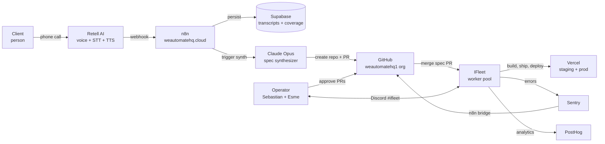
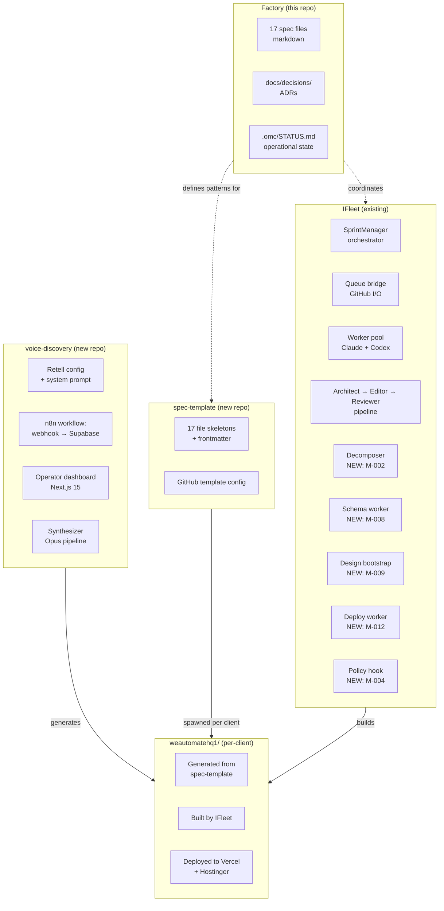

# Architecture

> Blend of matklad's pragmatic codemap + C4 Levels 1–2 (Context + Container) + arc42's invariants and cross-cutting sections. Mermaid only; no toolchain.

## 1. Problem & Goals

**Problem:** building custom SaaS for clients is slow because the operator (Sebastian) does both discovery and implementation. Discovery quality (asking the right questions, capturing real context) caps implementation quality. Manual context-capture leaks. Manual implementation is parallel-blocked by the human.

**Goal:** decouple discovery from implementation. Use AI to (a) run higher-quality discovery than the operator can do live, (b) translate discovery into a complete spec, (c) build from spec with autonomous workers, (d) self-heal during build and after launch.

**Non-Goal:** see `NON_GOALS.md`. The Factory is internal agency leverage, not a productized dev tool.

Related: see `ROADMAP.md`, `NON_GOALS.md#no-gos`.

## 2. System Context (C4 Level 1)



**External systems:**
- **Retell AI** — voice + telephony (auth: API key)
- **n8n** (self-hosted at weautomatehq.cloud) — orchestration
- **Supabase** — transcripts, coverage tracking, per-client app data
- **Claude Opus** — synthesizer brain
- **GitHub** — code + spec storage + Issues queue (the unit of work — see ADR-0003)
- **Vercel** — preview deploys + production hosting
- **Sentry** + **PostHog** — error tracking + analytics (feeds Tier 3 self-healing)
- **Hostinger** — VPS for any non-Vercel surfaces + DNS API
- **Stripe** — billing for client SaaS (when applicable)
- **Documenso** (sign.weautomatehq.cloud) — e-signing for client contracts

**Personas:**
- **Client** — buys a SaaS from WeAutomateHQ. Interacts with The Factory only via the voice interview.
- **Operator** — Sebastian (Driver + Approver) and Esme (Builder + Contributor). See `STAKEHOLDERS.md`.

Related: see `INTEGRATIONS.md` for auth model per service.

## 3. Container View (C4 Level 2)



**Containers / repos:**

| Repo | Tech | Responsibility | Talks to |
|---|---|---|---|
| `factory` (this) | Markdown only | Master spec + ADRs + status | All others (read-only) |
| `voice-discovery` | Next.js 15 + n8n + Supabase | Run interviews, synthesize spec PR | Retell, Supabase, GitHub |
| `spec-template` | Markdown only | GitHub template repo | None — copied per client |
| `IFleet` | TypeScript + tsx | Build robot army | GitHub, client repos, Sentry, n8n |
| `<client-name>` | Next.js 15 + Supabase + Stripe etc. | The actual client SaaS | Per client's INTEGRATIONS.md |

## 4. Codemap (top-level folders, this repo)

```
factory/
├── AGENTS.md                  # AI worker rulebook (primary; cross-vendor)
├── CLAUDE.md                  # Claude bridge via @AGENTS.md import
├── README.md                  # human orientation
├── ROADMAP.md                 # [M-NNN] milestones with depends-on DAG
├── ARCHITECTURE.md            # this file
├── SPRINT.md                  # current active sprint
├── FILE_STRUCTURE.md          # directory + naming conventions
├── UBIQUITOUS_LANGUAGE.md     # domain glossary
├── INTAKE.md                  # raw client interview (skeleton at template stage)
├── NON_GOALS.md               # explicit out-of-scope
├── STAKEHOLDERS.md            # DACI decision rights
├── RISKS.md                   # FMEA risk register
├── KPI.md                     # success metrics (skeleton at template stage)
├── RUNBOOK.md                 # ops playbook (skeleton at template stage)
├── ENV.md                     # env vars (names + sources, NEVER values)
├── INTEGRATIONS.md            # third-party services + auth
├── SECURITY.md                # threat model + protected paths
├── DECISIONS.md               # auto-generated ADR index
├── CHANGELOG.md               # Keep a Changelog + SemVer
├── docs/
│   └── decisions/
│       ├── _template.md       # MADR format
│       └── NNNN-*.md          # one ADR per file
└── .omc/
    ├── STATUS.md              # Done / In flight / Up next
    └── costs.json             # usage log
```

## 5. Architectural Invariants (explicit absences)

These are the rules that don't show up by reading code — they show up by violations breaking the system.

1. **The Factory repo contains no executable code.** Markdown only. Code lives in IFleet / voice-discovery / per-client repos.
2. **The 17 spec files are the contract.** If code contradicts a spec, the spec wins. Open an issue; do not silently drift.
3. **Issues are the unit of work for IFleet.** Voice interview, self-healing, monitoring, humans — all upstream sources go through "create issue" → "worker picks up." See ADR-0003.
4. **No worker self-merges.** A human or designated reviewer agent merges every PR. Even green CI does not authorize self-merge.
5. **Auth / billing / PII paths are always human-merge.** Listed in `SECURITY.md#protected-paths`. The auto-merge gate enforces this regardless of confidence.
6. **The client's word always wins in `UBIQUITOUS_LANGUAGE.md`.** If client says "matter," we use "matter" everywhere. Aliases are banned, not just discouraged.
7. **ADRs are append-only via filename discipline.** One per file at `docs/decisions/NNNN-*.md`. Supersede via new file with `supersedes:` frontmatter. Never edit accepted ones.
8. **INTAKE.md stays raw forever.** Synthesis happens elsewhere. INTAKE is the evidence bucket so future agents can re-derive synthesis when models improve.
9. **No `.yaml` siblings of spec files unless markdown parsing has demonstrably failed.** Premature sync layer creates drift. See ADR-0001 reasoning.
10. **Cross-cutting concerns (auth, error handling, logging, RLS) are AGENTS.md-enforced patterns, not freestyle.** Policy hook (M-004) catches drift before merge.

## 6. Cross-Cutting Concerns

| Concern | Where it lives | Owner |
|---|---|---|
| **Authentication** | per-client repo `lib/auth/`; protected path | `SECURITY.md` |
| **Multi-tenant isolation** | Supabase RLS policies; `lib/api-guard/` | `supabase-multitenant` skill |
| **Logging** | Structured JSON to stdout + Sentry breadcrumbs (see standard below) | `AGENTS.md` §6 |
| **Error handling** | API boundary returns `{ data, error, status }`; never expose stack traces | `AGENTS.md` §6 |
| **Observability** | Sentry + PostHog + n8n execution history + Session Report plugin | `KPI.md` |
| **Cost tracking** | per-session in `.omc/costs.json`; daily aggregate in Discord digest | `M-019` |
| **Secrets management** | 1Password vault → env vars at deploy; names only in `ENV.md` | `SECURITY.md` |
| **Killswitches** | env vars `SELF_HEAL_BUILD`, `SELF_HEAL_DEPLOY`, `SELF_HEAL_RUNTIME` | per-client `RUNBOOK.md` |

### Logging standard (closes AUDIT-factory-47e08664)

All server-side code across IFleet, voice-discovery, and per-client repos MUST follow this minimal standard. Policy hook (M-004) will enforce it pre-merge.

**Format:** Structured JSON to stdout (one object per line). Human-readable in dev via `pino-pretty` or equivalent. Machine-readable in production.

**Fields (required on every log line):**

| Field | Type | Notes |
|---|---|---|
| `level` | `"error" \| "warn" \| "info" \| "debug"` | No trace/verbose in production |
| `ts` | ISO-8601 UTC | `new Date().toISOString()` |
| `module` | `"[module-name]"` | e.g. `"[discord-source]"` |
| `msg` | string | Human-readable, no PII in the message itself |

**PII redaction rules:**
- Never log: email addresses, phone numbers, full names, IP addresses, Stripe card data, Supabase `service_role` keys.
- If a field may contain PII, log its hash or a truncated hint: `email: sha256(email).slice(0,8)`.
- Transcripts (voice interview) are logged only by session ID reference, never verbatim.

**Dual-channel pattern:**
- **stdout** → structured JSON (Sentry SDK attaches breadcrumbs from this stream automatically).
- **Sentry** → errors and warns only. Use `Sentry.captureException(err)` at API boundaries; no duplicate manual calls inside helpers.
- Never send PII to Sentry `extra` or `tags` fields.

**Severity guidelines:**
- `error` — unrecoverable failure; human action required.
- `warn` — degraded state; system continues but an operator should know.
- `info` — normal significant lifecycle event (task picked, PR opened, deploy triggered).
- `debug` — detailed trace; disabled in production by default (`LOG_LEVEL=info`).

## 7. Boundaries & Layers

### Facade pattern (PostHog-inspired)
Each "feature module" in a client repo exposes a single `facade.ts` file. Other features import **only** from the facade. Internal implementation is invisible to siblings.

```
features/billing/
├── api/
├── components/
├── lib/
├── schemas/
└── facade.ts        ← ONLY public export. Other features import from here.
```

### Inter-repo boundaries
| Boundary | Rule |
|---|---|
| `factory` → others | Reference only (docs cite repos by name, never code-import) |
| `voice-discovery` → `spec-template` | Reads as a remote source-of-truth; commits new repos from it |
| `spec-template` → client repos | Template-only relationship (copied at creation, then independent) |
| `IFleet` → client repos | Workers commit to client repos; never modify own repo from a client task |
| Client repo → `IFleet` | Never (no upward dependency) |

### Decomposer ↔ ROADMAP contract
The decomposer's parser is the only consumer of ROADMAP.md's `[M-NNN]` blocks. Changing the block format = breaking change. Bump format version in frontmatter if altering.

## 8. Glossary

See `UBIQUITOUS_LANGUAGE.md`. Do not duplicate definitions here.

Quick pointers:
- **Factory, IFleet, Decomposer, Synthesizer, Spec, Worker, Tier, Gate, Killswitch, Protected Path** — all defined in UBIQUITOUS.

---

**Last updated:** 2026-06-23
**Last verified:** 2026-06-23 — nightly audit
