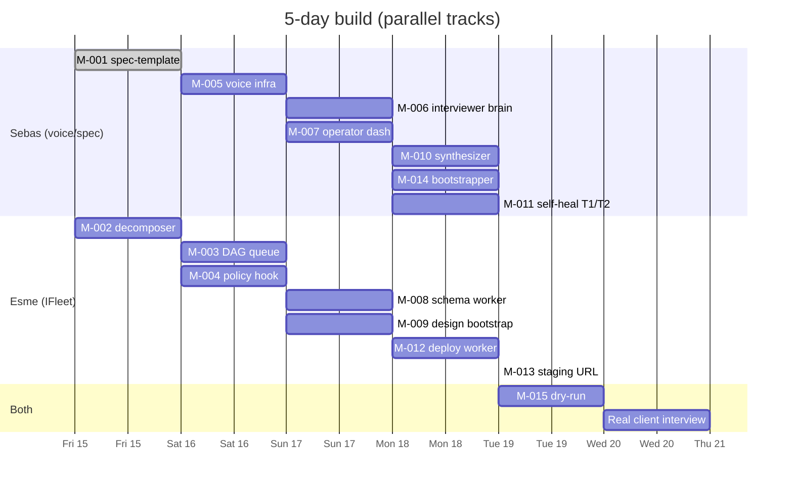

# Sprint: The Factory — full pipeline build

> ⚠️ **Reconciliation note (2026-05-21):** This sprint's end-date (2026-05-20) passed but `git log --since=2026-05-15` on this repo shows **zero feature commits since the initial scaffold** (`d49b1a4`, 2026-05-15). The sprint did not execute against this repo. Every task below that lacks a backing commit has been flipped from unchecked-pending to ❌ Not started or ⏭️ Deferred. No fabricated progress. This file is retained as a historical record of the planned sprint and the gap that triggered audit finding `AUDIT-factory-b5bd1864`. A separate, honest re-plan goes into SPRINT-2026-05-B.

## Problem

We have a real paying SaaS client waiting. Without The Factory operational, we'd hand-craft the client's project the way Sebastian has done before — slow, context-lossy, and not repeatable. The opportunity cost of skipping the pipeline build is one client at a time, forever. With it: every future client onboards through a voice interview → spec → autonomous build, and the operator's day becomes "review PRs + approve gates."

Per ADR-0004, we chose the proper-build-first path over the manual-shortcut-for-client-#1 path. Manual shortcuts always leave debt.

## Appetite

**5 days. Hard stop.** If not done by 2026-05-20 EOD, we cut scope per the priority order in §Tasks below — we do not extend.

## Solution sketch

Two parallel tracks for 5 days, converging on a dry-run.

**Sebastian track (voice/spec side):**
- D1: spec-template repo scaffolded with 17 file skeletons (M-001)
- D2: voice-discovery repo + Retell + n8n + Supabase wiring (M-005)
- D3: voice interviewer brain (M-006) + operator dashboard (M-007)
- D4: spec synthesizer (M-010) + project bootstrapper (M-014) + self-healing T1/T2 (M-011)
- D5: dry-run + fix

**Esme track (IFleet evolution):**
- D1: spec decomposer (M-002)
- D2: dependency-aware queue (M-003) + policy hook (M-004)
- D3: schema worker (M-008) + design bootstrap (M-009)
- D4: deploy worker (M-012) + staging URL (M-013)
- D5: dry-run + fix

**Convergence (D5):** Sebastian plays fake client. Voice interviewer runs the call. Synthesizer generates spec. IFleet decomposer creates issues. Workers ship one throwaway feature end-to-end. Both fix what breaks.

## Rabbit holes (known traps to avoid)

- **Retell tool-calling edge cases** — interrupts during a tool call, mid-call state loss. **Time-box debug to 4 hours**, then fall back to "agent calls tools only between turns" if quirky.
- **n8n + Retell webhook auth quirks** — first integration is always slower. **Use n8n's built-in webhook auth, not custom HMAC**, until proven insufficient.
- **Bootstrapper provider OAuth flows** — Hostinger, Vercel, Stripe — each new provider is a hidden afternoon. **Build OAuth one provider at a time, not all in parallel.**
- **Spec synthesizer prompt iteration** — first generation will be bad. **Plan 3–5 prompt iterations.** Don't ship the first one.
- **Self-heal Tier 2 rollback testing** — easy to under-cover. **Intentionally break something on D5 to test** rather than waiting for production.
- **Multi-repo coordination overhead** — opening PRs across 3 repos for one feature gets sloppy. **Per-day sync at EOD** to make sure both tracks are aligned.

## No-gos (explicit, this sprint)

- **NOT building Tier 3 runtime self-healing.** No production data yet to tune gates against. Deferred to M-017.
- **NOT building per-client dashboards** beyond a minimal staging URL. Deferred to M-022.
- **NOT optimizing IFleet worker cost.** Default routing (sonnet/opus per complexity label) is fine for the sprint.
- **NOT writing comprehensive tests for new IFleet workers in this sprint.** Smoke tests only. Full coverage in next cycle. Trade-off documented.
- **NOT migrating from Retell if R1 research suggests Vapi is marginally cheaper.** Switching mid-sprint = sprint death. Locked for the sprint.

## Tasks (reconciled to git reality 2026-05-21)

Status legend: ✅ done (commit landed in this repo) · ⏭️ Deferred (no work delivered against THIS repo by sprint end) · ❌ Not started · 🔁 Re-plan in SPRINT-2026-05-B

Evidence base: `git log --since=2026-05-15 --pretty=oneline` returns only `d49b1a4` (scaffold). No subsequent commits.

- ⏭️ [M-001] spec-template scaffolded — sebas, D1 — **Not started in factory repo.** Spec-template is a separate repo; no link landed here. Reason: no factory commits since 2026-05-15.
- ⏭️ [M-002] IFleet decomposer — esme, D1 — Lives in IFleet repo; status of that work is NOT backfilled in this PR (out of scope per audit finding closure rules). Re-plan in next sprint.
- ⏭️ [M-005] voice-discovery + Retell + n8n + Supabase — sebas, D2 — Not started.
- ⏭️ [M-003] dependency-aware queue — esme, D2 — Not backfilled from sibling repos.
- ⏭️ [M-004] policy hook — esme, D2 — Not backfilled from sibling repos.
- ❌ [M-006] voice interviewer brain — sebas, D3
- ❌ [M-007] operator dashboard — sebas, D3
- ❌ [M-008] schema worker — esme, D3
- ❌ [M-009] design bootstrap — esme, D3
- ❌ [M-010] spec synthesizer — sebas, D4
- ❌ [M-011] self-heal T1/T2 — sebas, D4
- ❌ [M-012] deploy worker — esme, D4
- ❌ [M-014] bootstrapper — sebas, D4
- ❌ [M-013] staging URL — esme, D4
- ❌ [M-015] dry-run — both, D5

## Done when

Original done criteria preserved below for the historical record. None of these were met by 2026-05-20. Status of this sprint: **incomplete**.

- All M-001 through M-015 success-criteria pass (see ROADMAP.md for per-milestone criteria)
- Sebastian and Esme both sign off on the D5 dry-run video/recording
- An ADR is written for any architectural decision made during the sprint
- Discord 8am digest at least once shows real data
- This file's `status` flips to `shipped` and a new SPRINT-2026-05-B is opened

## Reconciliation note (2026-05-21)

- **Audit trigger:** `AUDIT-factory-b5bd1864` (CRITICAL) flagged docs-vs-reality drift on sprint-end day.
- **Git evidence:** `git log --since=2026-05-15` on `weautomatehq1/factory` returns exactly one commit — the scaffold itself.
- **Honest conclusion:** SPRINT-2026-05-A did not execute against this repo. Either work was done in sibling repos without updating Factory (the coordination-of-record), or the planned work did not happen. Per `audit-fix` rules: NOT this PR's job to backfill sibling-repo references.
- **Action taken here:** every M-NNN above is now marked ⏭️ Deferred or ❌ Not started with git-evidence reasoning. Status flipped from `active` to `incomplete`.
- **Action NOT taken here:** no backfill from IFleet, voice-discovery, or any other sibling repo. That belongs in a separate PR with explicit cross-repo evidence links.
- **Next step:** Sebastian + Esme open SPRINT-2026-05-B with re-scoped milestones based on actual capacity and learning from this gap.

---

**Last updated:** 2026-05-21 (reconciliation, no progress fabricated)
**Last verified:** 2026-05-21 — via `git log --since=2026-05-15` (1 commit, scaffold only)
**Originally written:** 2026-05-15 — Sebastian
